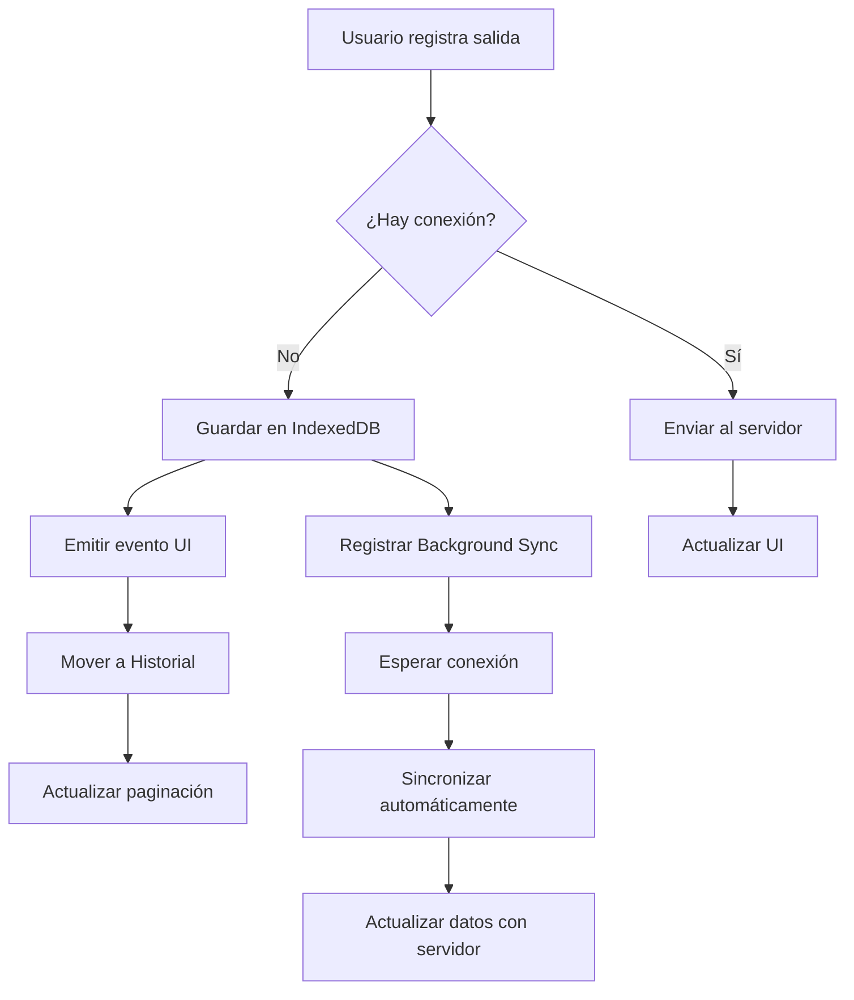

# 📱 Registro de Salida de Visitantes en Modo Offline

## ✨ Funcionalidad Implementada

Se ha implementado exitosamente el registro de salida de visitantes en modo offline con sincronización automática. El sistema permite registrar salidas sin conexión a internet y actualiza dinámicamente la interfaz de usuario.

### 🎯 Características Principales

1. **Registro Offline Inmediato** - Las salidas se registran localmente sin conexión
2. **Actualización UI Instantánea** - El visitante desaparece de "Activos" y aparece en "Historial" inmediatamente
3. **Sincronización Automática** - Cuando vuelve la conexión, se sincroniza con el servidor
4. **Actualización Dinámica** - Los datos del visitante se actualizan con información correcta del servidor
5. **Persistencia Local** - Los datos se mantienen en IndexedDB hasta la sincronización

---

## 🏗️ Arquitectura de la Solución

### Flujo de Registro Offline



### Componentes Modificados

#### 1. **Servicio Offline API** (`offlineApiService.js`)
- ✅ Función `registrarSalidaWithOfflineSupport()` mejorada
- ✅ Emisión de eventos personalizados para actualización UI
- ✅ Soporte para datos del visitante en salidas offline

#### 2. **Base de Datos Offline** (`offlineDB.js`)
- ✅ Función `saveSalidaOffline()` mejorada
- ✅ Almacenamiento de datos del visitante para referencia
- ✅ Estructura optimizada para sincronización

#### 3. **Motor de Sincronización** (`offlineSync.js`)
- ✅ Función `syncPendingSalidas()` mejorada
- ✅ Emisión de eventos de sincronización completada
- ✅ Actualización dinámica de datos del servidor

#### 4. **Dashboard Principal** (`DashboardVigilantePage.jsx`)
- ✅ Listeners para eventos de salida offline
- ✅ Actualización inmediata de UI
- ✅ Manejo de sincronización automática
- ✅ Búsqueda de historial mejorada para modo offline

---

## 🔄 Flujo de Funcionamiento

### 1. **Registro de Salida Offline**

Cuando el usuario registra una salida sin conexión:

1. **Detección de Estado**: El sistema detecta que no hay conexión
2. **Almacenamiento Local**: Se guarda la salida en IndexedDB con datos del visitante
3. **Evento UI**: Se emite evento `offline-salida-registrada`
4. **Actualización Inmediata**: 
   - Visitante desaparece de "Visitantes Activos"
   - Aparece inmediatamente en "Historial de Visitas"
   - Se actualiza la paginación automáticamente

### 2. **Sincronización Automática**

Cuando vuelve la conexión:

1. **Background Sync**: Se activa automáticamente la sincronización
2. **Envío al Servidor**: Se envía la salida pendiente al backend
3. **Evento de Sincronización**: Se emite `offline-salida-sincronizada`
4. **Actualización de Datos**: 
   - Se actualizan los datos del visitante con información del servidor
   - Se preservan los datos originales de la salida offline
   - Se marca como sincronizada

### 3. **Búsqueda de Historial**

El historial funciona tanto online como offline:

- **Modo Online**: Consulta la base de datos del servidor
- **Modo Offline**: Muestra datos locales incluyendo salidas offline
- **Filtros**: Se aplican correctamente en ambos modos

---

## 📋 Datos Almacenados Offline

### Estructura de Salida Offline

```javascript
{
  id: "auto_increment_id",
  visitaId: "id_de_la_visita",
  timestamp: "timestamp_de_registro",
  status: "pending",
  syncAttempts: 0,
  visitanteData: {
    nombres: "Nombres del visitante",
    apellidos: "Apellidos del visitante", 
    numeroDocumento: "DNI del visitante",
    personal_nombres: "Nombre del empleado",
    personal_apellidos: "Apellidos del empleado",
    personal_cargo: "Cargo del empleado",
    nombre_motivo: "Motivo de la visita",
    nombre_area: "Área de destino"
  }
}
```

---

## 🎨 Mejoras en la UI

### Indicadores Visuales

1. **Mensajes de Estado**: 
   - "Salida guardada localmente. Se sincronizará cuando vuelva la conexión."
   - "Conexión perdida. Salida guardada localmente."

2. **Actualización Inmediata**:
   - Transición suave de activos a historial
   - Contadores de paginación actualizados automáticamente
   - Datos del visitante preservados durante la transición

3. **Sincronización Transparente**:
   - Actualización automática cuando vuelve la conexión
   - Preservación de datos originales offline
   - Actualización con datos correctos del servidor

---

## 🔧 Configuración Técnica

### Eventos Personalizados

```javascript
// Evento emitido al registrar salida offline
window.dispatchEvent(new CustomEvent('offline-salida-registrada', {
  detail: { 
    salidaId: "id_de_salida",
    visitaId: "id_de_visita", 
    timestamp: "timestamp",
    visitanteData: "datos_del_visitante"
  }
}));

// Evento emitido al sincronizar salida
window.dispatchEvent(new CustomEvent('offline-salida-sincronizada', {
  detail: { 
    salidaId: "id_de_salida",
    visitaId: "id_de_visita",
    responseData: "datos_del_servidor"
  }
}));
```

### Listeners en Dashboard

```javascript
// Listener para salidas registradas offline
window.addEventListener('offline-salida-registrada', handleOfflineSalidaRegistrada);

// Listener para salidas sincronizadas
window.addEventListener('offline-salida-sincronizada', handleOfflineSalidaSincronizada);
```

---

## ✅ Casos de Uso Cubiertos

### 1. **Registro Offline Completo**
- ✅ Usuario sin conexión registra salida
- ✅ Visitante desaparece de activos inmediatamente
- ✅ Aparece en historial con datos de salida
- ✅ Datos se mantienen hasta sincronización

### 2. **Sincronización Automática**
- ✅ Conexión se restaura automáticamente
- ✅ Salidas pendientes se sincronizan
- ✅ Datos del visitante se actualizan con información del servidor
- ✅ UI se actualiza dinámicamente

### 3. **Búsqueda y Filtros**
- ✅ Historial funciona en modo offline
- ✅ Filtros se aplican correctamente
- ✅ Datos offline se incluyen en búsquedas
- ✅ Paginación funciona correctamente

### 4. **Manejo de Errores**
- ✅ Errores de red se manejan gracefully
- ✅ Fallback a modo offline automático
- ✅ Mensajes informativos al usuario
- ✅ Recuperación automática de conexión

---

## 🚀 Beneficios de la Implementación

1. **Experiencia de Usuario Mejorada**: 
   - No interrupciones por falta de conexión
   - Feedback inmediato de acciones
   - Transiciones suaves entre estados

2. **Confiabilidad del Sistema**:
   - Datos nunca se pierden
   - Sincronización automática y transparente
   - Manejo robusto de errores

3. **Eficiencia Operativa**:
   - Trabajo continuo sin conexión
   - Sincronización en segundo plano
   - Actualizaciones dinámicas de datos

4. **Escalabilidad**:
   - Arquitectura modular y extensible
   - Fácil mantenimiento y actualizaciones
   - Compatible con futuras funcionalidades

---

## 📝 Notas de Implementación

- **Compatibilidad**: Funciona con navegadores modernos que soportan IndexedDB
- **Performance**: Actualizaciones UI optimizadas para evitar re-renders innecesarios
- **Memoria**: Datos offline se limpian automáticamente después de sincronización
- **Debugging**: Logs detallados para facilitar el debugging en modo desarrollo

---

## 🔄 Próximos Pasos Sugeridos

1. **Testing Exhaustivo**: Probar todos los escenarios offline/online
2. **Optimización**: Mejorar performance en dispositivos de baja memoria
3. **Monitoreo**: Implementar métricas de sincronización
4. **Notificaciones**: Agregar notificaciones push para sincronización completada

---

*Implementación completada exitosamente - Sistema de Control de Acceso UGEL Talara*
