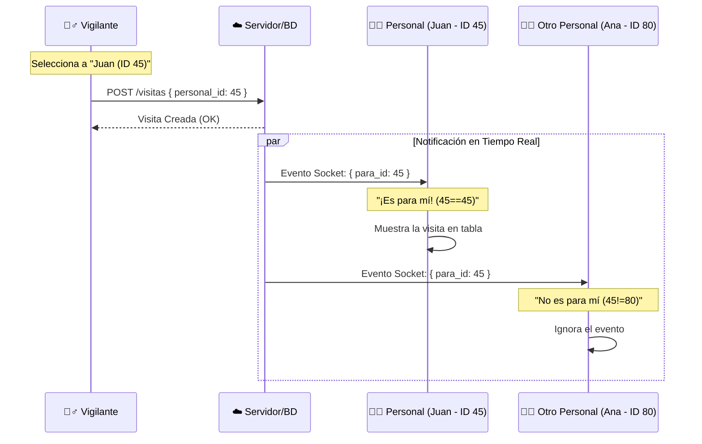

# 🔄 Flujo de Asignación de Visitas: Del Vigilante al Personal

Este documento explica técnicamente cómo el sistema asegura que una visita registrada por el vigilante aparezca **exclusivamente** en la pantalla del personal correcto.

## 🧠 El Concepto Clave: `personal_visitado_id`

Todo el sistema gira en torno a un identificador único. Cuando un empleado es creado en el sistema, tiene un **ID único** (ej. `ID: 45` para "Juan Pérez").

### 1. El Registro (Vigilante) 👮‍♂️

Cuando el vigilante está en la puerta y registra a un visitante:

1.  Selecciona al empleado de una lista desplegable (ej. "Juan Pérez").
2.  El sistema captura el ID de ese empleado (`45`).
3.  Se envía una petición al servidor con este dato.

```json
// Lo que envía el Vigilante al crear la visita
{
  "visitante_nombres": "María",
  "visitante_apellidos": "Gómez",
  "personal_visitado_id": 45, // <--- ¡Aquí está la clave!
  "motivo": "Reunión de trabajo"
}
```

### 2. La Base de Datos (Almacenamiento) 💾

El servidor guarda esta visita en la tabla `RegistrosVisitas` y crea un vínculo permanente:

| ID Visita | Visitante   | **Personal Visitado ID** | Estado    |
| :-------- | :---------- | :----------------------- | :-------- |
| 1024      | María Gómez | **45**                   | PENDIENTE |

### 3. La Vista del Personal ("Mis Visitas") 👨‍💼

Cuando Juan Pérez se loguea en su computadora:

1.  El sistema identifica quién es el usuario logueado (`user.personal_id = 45`).
2.  La página `MisVisitasPage` descarga las visitas.
3.  **El Filtro de Seguridad:** El código compara el ID de la visita con el ID del usuario.

> **Lógica del Código (Simplificada):** > _"¿El `personal_visitado_id` de esta visita (45) es igual a MI id (45)? Sí -> Muéstrala. No -> Ignórala."_

```javascript
// MisVisitasPage.jsx
const visitasParaMi = todasLasVisitas.filter((visita) => {
  // Compara el ID de la visita con el ID del usuario logueado
  return visita.personal_visitado_id === miUsuario.personal_id;
});
```

### 4. Tiempo Real (Socket.IO) ⚡

Para que aparezca al instante sin recargar la página:

1.  El servidor emite un grito digital: _"¡Nueva visita para el empleado 45!"_.
2.  Tu navegador está escuchando.
3.  Si tu ID es 45, atrapas el mensaje y actualizas la tabla. Si tu ID es 80, ignoras el mensaje.

```javascript
socket.on("nueva_visita_registrada", (visita) => {
  // ¿Esta visita es para mí?
  if (visita.personal_visitado_id === miUsuario.personal_id) {
    mostrarNotificacion("¡Tienes una nueva visita!");
    actualizarTabla();
  }
});
```

---

## 📊 Diagrama de Secuencia



## Resumen

La "magia" es simplemente que la visita lleva una etiqueta (`personal_visitado_id`) que dice a quién pertenece. Tu página de "Mis Visitas" actúa como un filtro que solo deja pasar las visitas que llevan **tu etiqueta**.
