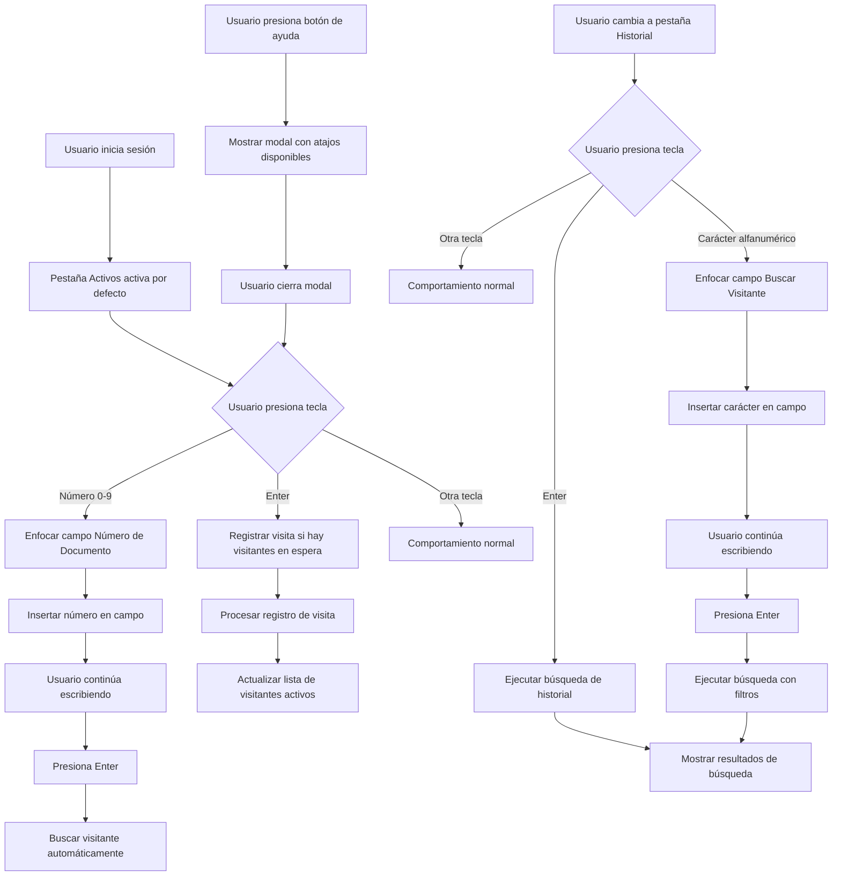

# Flujo de Trabajo con Atajos de Teclado

## Diagrama de Flujo

## Casos de Uso Optimizados

### 1. Registro Rápido de Visita

**Flujo tradicional:**
1. Hacer clic en campo "Número de Documento"
2. Escribir número
3. Hacer clic en botón "Buscar"
4. Llenar datos de visita
5. Hacer clic en "Registrar Visita Completa"

**Flujo optimizado:**
1. Presionar número → Campo se enfoca automáticamente
2. Escribir número completo
3. Presionar Enter → Búsqueda automática
4. Llenar datos de visita
5. Presionar Enter → Registro automático

**Ahorro de tiempo:** ~3-4 clics menos por visita

### 2. Búsqueda Rápida en Historial

**Flujo tradicional:**
1. Hacer clic en pestaña "Historial"
2. Hacer clic en campo "Buscar Visitante"
3. Escribir término de búsqueda
4. Hacer clic en "Buscar Visita"

**Flujo optimizado:**
1. Hacer clic en pestaña "Historial"
2. Presionar primera letra → Campo se enfoca automáticamente
3. Escribir término completo
4. Presionar Enter → Búsqueda automática

**Ahorro de tiempo:** ~2-3 clics menos por búsqueda

## Beneficios Cuantificables

### Para el Vigilante
- **Reducción de clics:** 60-70% menos clics por operación
- **Velocidad de registro:** 40-50% más rápido
- **Fatiga de mouse:** Significativamente reducida
- **Errores de clic:** Menos errores por clics incorrectos

### Para el Sistema
- **Eficiencia operativa:** Mayor throughput de visitas
- **Experiencia de usuario:** Flujo más fluido y profesional
- **Adopción:** Menor curva de aprendizaje para nuevos usuarios
- **Productividad:** Más tiempo para tareas de valor agregado

## Consideraciones de Implementación

### Seguridad
- Los atajos solo funcionan cuando el usuario está autenticado
- No interfieren con la validación de formularios
- Mantienen la integridad de los datos

### Accesibilidad
- Compatible con lectores de pantalla
- No bloquea la navegación por teclado estándar
- Funciona con tecnologías de asistencia

### Mantenibilidad
- Código modular y reutilizable
- Fácil de extender con nuevos atajos
- Documentación completa incluida
